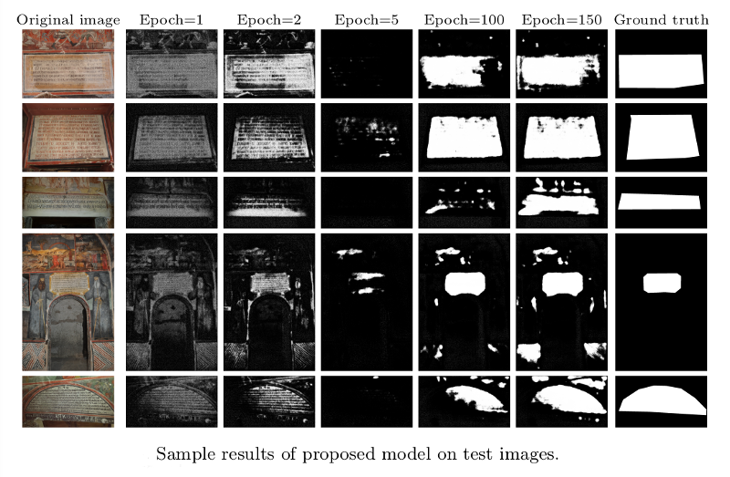

# Paper code for "Quaternion Generative Adversarial Networks for Inscription Detection in Byzantine Monuments"

This repository contains source code for the paper "
[Quaternion Generative Adversarial Networks for Inscription Detection in Byzantine Monuments](http://cs.uoi.gr/~sfikas/icprw-quaternion-gan.pdf)
" by Sfikas et al. (PatReCH 2020).



## Requirements

Please follow first the instructions in https://github.com/Orkis-Research/Pytorch-Quaternion-Neural-Networks to install the Quaternion Convolution layer code.

## Code execution

The main executable is ```quaternion-gan.py```, which will train the model using data found in the ```fixtures/``` folder.
You can use the code by supplying your own data, which should come in pairs of image (png) and annotation (npz) files (see BessarionMini class for details).
*The Byzantine inscription data used for the paper experiments will be uploaded together with an upcoming publication.*

If you find the paper and/or the code useful, please cite the paper using the following bibtex code:

```
@inproceedings{sfikas2021quaternionGAN,
  title={Quaternion Generative Adversarial Networks for Inscription Detection in Byzantine Monuments},
  author={Sfikas, Giorgos and Giotis, A.P. and Retsinas, George and Nikou, Christophoros},
  booktitle={2^{nd} International Workshop on Pattern Recognition for Cultural Heritage (PatReCH)},
  year={2021}
}
```
